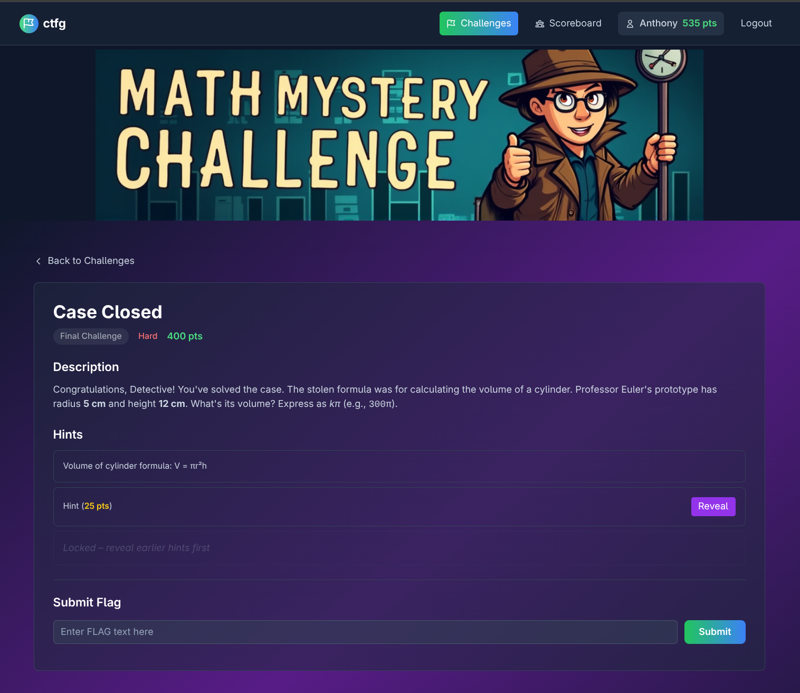

# ctfg

This is a simple Capture-The-Flag game engine.




## Building and Running

You will need to install a few dependencies first.  If you are running homebrew,
run...
```sh
brew install make sbcl ocicl gcc@11
```

Otherwise, install `sbcl` from your OS distribution, and then `ocicl` from source at https://github.com/ocicl/ocicl.

Once `ocicl` is available, run `ocicl install` to download the Common
Lisp dependencies.

And then...

* To build `ctfg`: `make`
* To test `ctfg`: `make check`
* To run `ctfg`: `ctfg --help`

```
NAME:
  ctfg - A Capture-The-Flag Game Engine

USAGE:
  ctfg

OPTIONS:
      --help                   display usage information and exit
      --version                display version and exit
  -b, --dbdir <VALUE>          database directory [default: .]
  -d, --developer-mode         enable developer mode
  -p, --port <INT>             port [default: 8080]
  -s, --slynk-port <INT>       slynk-port
  -w, --websocket-url <VALUE>  websocket-url [default: ws://localhost:12345/scorestream]

EXAMPLES:

  Run web service on port 9090:

    ctfg -p 9090

AUTHORS:
  Anthony Green

LICENSE:
  MIT
```

The `--developer-mode` option disables caching of static content, and
reloads the challenges.json every time the Challenge page is
rendered.  This allows you view your changes in real time as you are
developing content.

Client browsers must establish websocket connections back to the game
engine on the `/scorestream` endpoint.  Use the `--websocket-url`
option to tell those clients what the URL is.  For instance, if you
are hosting ctfg on an OpenShift kubernetes cluster, you might create
a TLS terminated route for your ctfg service and connect to it thusly:
`-w wss://scorestream-ctfg.apps.ocp.example.com:443/scorestream`


## Configuring your Game

1. Player credentials should live in a file called `credentials.csv`.  It's a simple `username,password` csv file.

2. Challenges are in `challenges.json`.  This should be a json array containing objects like this:
```
        {
            "id": 5,
            "title": "SQL Injection Login",
            "category": "Web",
            "difficulty": "Easy",
            "points": 150,
            "description": "This is an HTML description of the challenge. Put whatever you want in here.",
            "flag": "^regexp flag goes here$",
            "requirements": [2, 3]
        },
```

  Each challenge needs a unique `id`.  All of the other fields are
  self-explanatory.  The `requirements` field is optional. It should
  be a list of challenges that must be solved before this challenge
  appears on the board.

3. Replace `static/images/banner.png` with your own content.

4. Edit `game-clusters.yaml` to point at the cluster hosting this app,
   as well as the list of player clusters (all possibly the same).
   Users are assigned to the different player clusters in a
   round-robin format as they join.


## Author and License

`ctfg` was written by Anthony Green and is distributed
under the terms of the MIT license.
